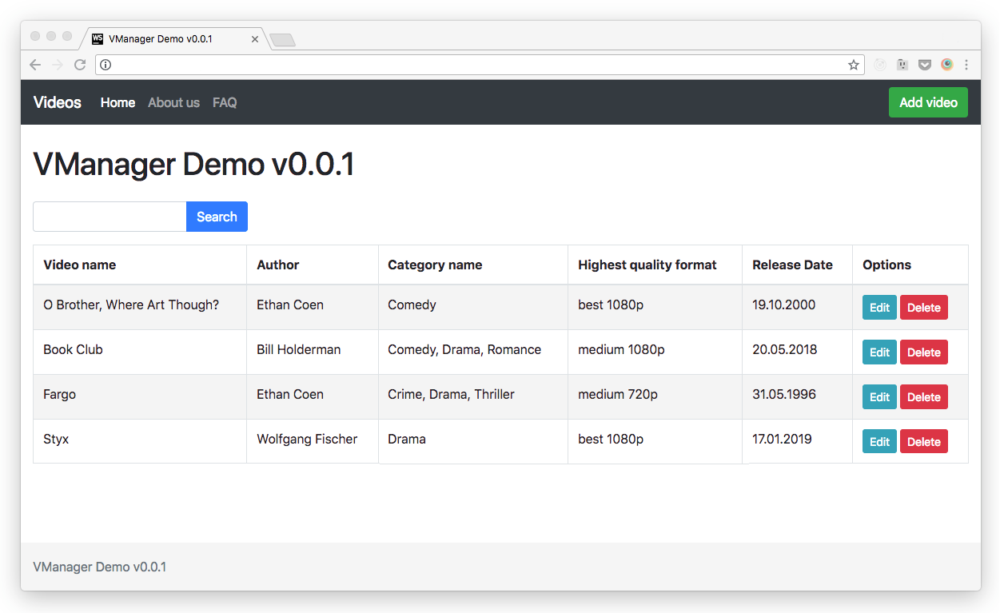
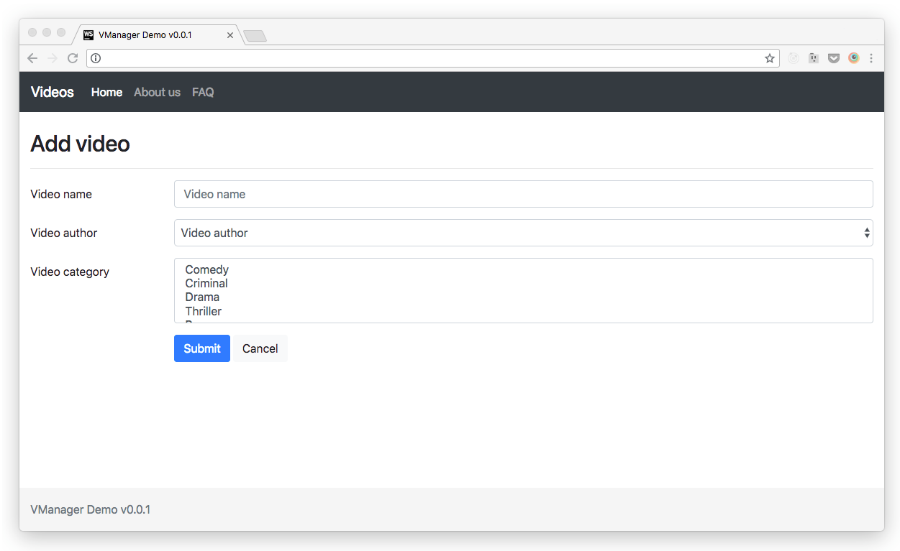
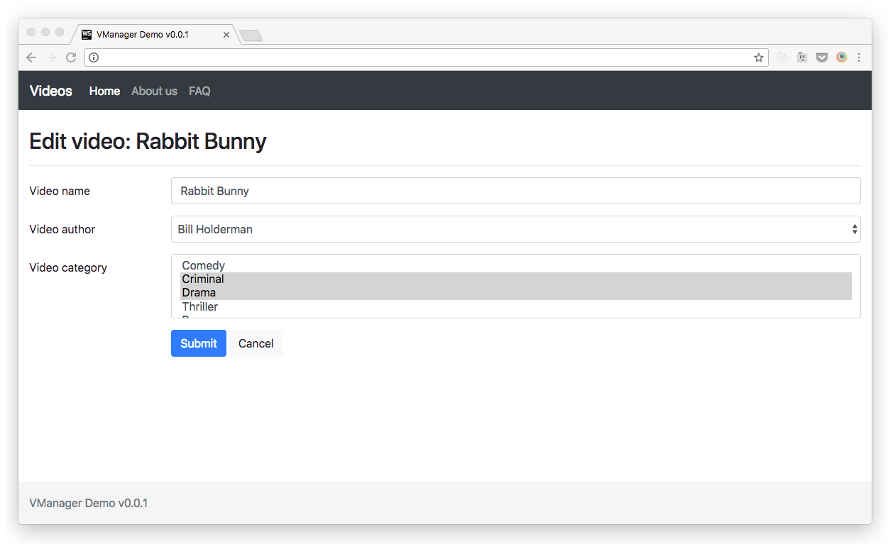

# Front-end developer challenge

The aim of the implementation is not to complete the assignment (of course this would be great), but rather to find out more about your approach, the ***quality, cleanliness and structure*** of your code, and get to know your personal ***prioritization***. This means that it’s better if send an unfinished app with code you can be proud of, rather than a complete app with lots of messy code.
Mockups in this task are just a design suggestion – you are free to implement any other design as soon as it looks OK and meets the requirements.

### Notes

- The backend can be accessed via http://localhost:3001
- It runs with a package called ***json-server***, and the data comes from the ***db.json*** file
- The JSON structure of the ***db.json*** file was twisted a bit on purpose. Please do not change the original DB structure. Of course, on the front-end side you are free to transform and manipulate the data in any way you feel appropriate
- Material-UI was added to the starter template. If you feel more comforable with another UI framework, you can change it. You can add all the styles that you need

## Steps for the challenge
- Clone this repository and complete the tasks below
- Upload your code to a repository of your choosing (GitHub, BitBucket, etc.) and send us the link

## Steps to run the project
- Install dependencies with:

```npm i```

- Run both the frontend and backend with:

```npm start```

## List view
UI Suggestion



### Requirements

- The landing page displays a list of videos with the following columns:
    - Video name
    - Author
    - Categories
    - Highest quality format (Values: ```<format-name> <quality>```, example: "two 1080p")
    - Release Date
    - Options (Buttons: ```Edit Delete```)
- The table/list can be searched
- **Optional**: The list can be sorted

Note: The "Highest quality format" is a made up label for the format where “res" property is the highest and “size" property is the biggest

## Add a video
UI Suggestion



### Requirements

- Clicking on the “Add video” button will take you to a form, which contains the following fields:
    - Video name
    - Video author (```<select>```)
    - Video category (```<select multiple>```)
- A new video can be saved and the user will be returned to the list view
- The new video object should automatically get the following property/value:
```
formats: {
    one: { res: “1080p”, size: 1000 }
}
```
- The process can be canceled and by doing so, the user is redirected to the list view
- ***Optional***: There are basic validations available (e.g.: The "Save" button is only active if all the content is valid)

## Edit a video
UI Suggestion



### Requirements
- There is an interaction element to edit existing video information
- Clicking on this element will take you to a form view
- All changes can be saved (e.g.: If canceled, the user is returned to the list view)
- ***Optional***: There are basic validations available

## Delete a video
UI Suggestion


### Requirements
- There is an interaction element to delete an existing video
- ***Optional***: A dialog will appear to confirm the deletion